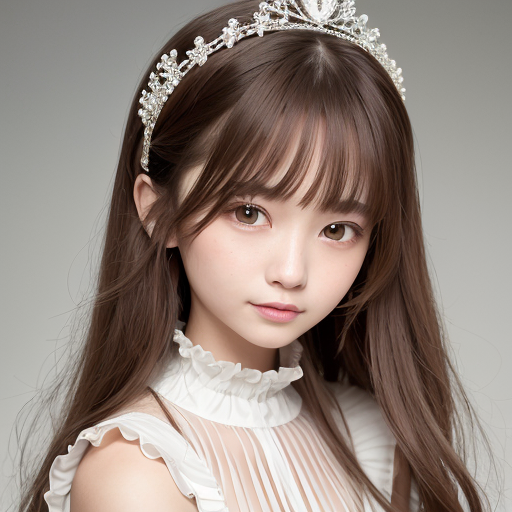

# DPM++ 2M Karras test

see Github Discussions: https://github.com/AUTOMATIC1111/stable-diffusion-webui/discussions/8457


Generation Info:

```
Prompt: portrait of a cute woman, clear delicate face, insanely frilled white dress, small tiara, absurdly long brown hair, long sleeves highneck dress, smiling, looking at viewer, beautiful eyes
Negative prompt: (low quality, worst quality:1.4), nsfw, maid, dutch angle, detached sleeves, opened mouth
Steps: 30, CFG scale: 7, Size: 512x512, ENSD: 31337
```

## Examples

- Left: DPM++ 2M Karras
- Right: DPM++ 2M Karras test (suggested)

Model: 7th_anime_v3_A


Model: Basil mix



